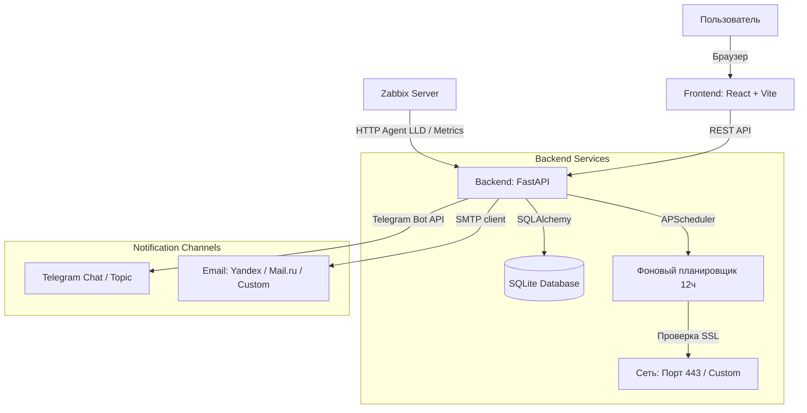

# 🛡️ Cert-Checker

<p align="center">
  
  
  
  
  
</p>


**Cert-Checker** — это современная, легкая и невероятно быстрая система мониторинга сроков действия SSL/TLS-сертификатов. Она разработана для системных администраторов и DevOps-инженеров, которым нужен надежный инструмент для контроля инфраструктуры без избыточной сложности.

Интерфейс спроектирован по канонам современных **SaaS-платформ (стиль Vercel & Linear)**: строгие прямоугольные формы, высокая контрастность, поддержка темной/светлой тем и плавная работа без перезагрузок страниц.

---

## 🛠️ Архитектура системы



---

## ✨ Ключевые фичи

*   **⚡ Мгновенный результат**: При добавлении сайта в панель проверка сертификата и расчет дней запускаются немедленно. Никаких пустых статусов «Не проверено».
*   **📊 Функциональный дашборд**: Удобная интерактивная таблица: домен, порт, статус (валиден/истекает/просрочен/ошибка сети), точные даты действия, графический прогресс-бар и издатель сертификата (CA).
*   **📺 ТВ-Режим (`/tv`)**: Специальная полноэкранная темная панель для вывода на системные мониторы или телевизоры в техническом отделе. Крупные шрифты, живые часы и неоновое пульсирующее свечение аварийных доменов, заметное издалека.
*   **🔔 Умные оповещения**:
    *   **Telegram**: Поддержка отправки в группы, каналы и в **конкретные темы (thread_id / топики)** групп.
    *   **Email (SMTP)**: Поддержка SSL (порт 465) и TLS (порт 587). Автоматическая подстановка отправителя `From` под ваш SMTP-логин для обхода спам-фильтров Gmail/Yandex.
    *   **Кнопка «Тест»**: Мгновенная отправка тестового сообщения `тест / TEST` прямо из панели управления для проверки настроек.
*   **🤖 Интеграция с Zabbix**: Автоматическое низкоуровневое обнаружение (LLD) всех добавленных сайтов и отдача метрик в формате JSON для бесшовной интеграции.

---

## 🚀 Быстрый старт (Docker Compose)

### 1. Клонирование репозитория
Сначала склонируйте репозиторий и перейдите в папку проекта:
```bash
git clone https://github.com/Ttolyanich/cert-checker.git
cd cert-checker
```

### 2. Подготовка конфигурации
В корне проекта находится файл `docker-compose.yml`. Вы можете настроить переменные окружения:

| Переменная | Описание | Значение по умолчанию |
| :--- | :--- | :--- |
| `DATABASE_URL` | Путь к базе данных SQLite | `sqlite:////data/cert_checker.db` |
| `SECRET_KEY` | Ключ для шифрования сессий и JWT | `change_me_in_production` |
| `ZABBIX_TOKEN` | Секретный токен для интеграции с Zabbix | `zabbix_secret_token` |

### 2. Запуск
Соберите и запустите контейнеры одной командой:
```bash
docker-compose up -d --build
```

Панель будет доступна по адресу: **`http://<IP_вашего_сервера>:8080`**

### 3. Первый вход (Дефолтные учетные данные)
*   **Логин**: `admin`
*   **Пароль**: `admin123`

*(Вы можете изменить пароль или создать новых администраторов в панели управления на вкладке «Администраторы»).*

---

## 🛠️ Развертывание без Docker (напрямую на хосте)

Если вы предпочитаете не использовать Docker, проект можно легко запустить непосредственно в операционной системе. Для этого вам понадобятся **Python 3.12** и **Node.js** (только для сборки фронтенда).

### 1. Клонирование репозитория
Склонируйте репозиторий и перейдите в папку проекта:
```bash
git clone https://github.com/Ttolyanich/cert-checker.git
cd cert-checker
```

### 2. Запуск Бэкенда (FastAPI)

1. Перейдите в папку бэкенда:
   ```bash
   cd backend
   ```
2. Создайте и активируйте виртуальное окружение Python:
   ```bash
   python3 -m venv venv
   source venv/bin/activate
   ```
3. Установите зависимости:
   ```bash
   pip install --upgrade pip
   pip install -r requirements.txt
   ```
4. Запустите сервер `uvicorn`:
   ```bash
   uvicorn app.main:app --host 127.0.0.1 --port 8000
   ```
   *(В продакшене рекомендуется настроить запуск uvicorn как системную службу `systemd`).*

### 2. Сборка и настройка Фронтенда (Nginx)

1. Перейдите в папку фронтенда, установите зависимости и соберите статические файлы:
   ```bash
   cd ../frontend
   npm install
   npm run build
   ```
   После этого в папке `frontend` появится готовая сборка в директории `dist`.

2. Настройте веб-сервер **Nginx** для раздачи статики фронтенда и проксирования API-запросов к бэкенду. Создайте конфигурационный файл (например, `/etc/nginx/sites-available/cert-checker`):

   ```nginx
   server {
       listen 8080;
       server_name _;

       root /opt/cert-checker/frontend/dist;
       index index.html;

       location / {
           try_files $uri $uri/ /index.html;
       }

       location /api {
           proxy_pass http://127.0.0.1:8000;
           proxy_set_header Host $host;
           proxy_set_header X-Real-IP $remote_addr;
           proxy_set_header X-Forwarded-For $proxy_add_x_forwarded_for;
           proxy_set_header X-Forwarded-Proto $scheme;
       }

       location /docs {
           proxy_pass http://127.0.0.1:8000/docs;
       }
       location /openapi.json {
           proxy_pass http://127.0.0.1:8000/openapi.json;
       }
   }
   ```

3. Активируйте конфигурацию и перезапустите Nginx:
   ```bash
   ln -s /etc/nginx/sites-available/cert-checker /etc/nginx/sites-enabled/
   nginx -t
   systemctl restart nginx
   ```

---

## 🤖 Интеграция с Zabbix (LLD)

В корне репозитория находятся два готовых файла шаблонов:
*   **`zabbix_template.yaml`** — для версий **Zabbix 6.0 / 6.4**.
*   **`zabbix_cert-checker_template.yaml`** — для версии **Zabbix 7.0**.

### Инструкция по настройке в Zabbix:
1.  Перейдите в **Configuration -> Templates -> Import** и импортируйте подходящий файл шаблона под вашу версию Zabbix.
2.  Создайте узел сети (Host) для сервера Cert-Checker.
3.  Прилинкуйте к нему импортированный шаблон **Cert-Checker SSL Monitoring**.
4.  Перейдите на вкладку **Macros (Макросы)** узла сети и заполните значения:
    *   `{$CERT_CHECKER_URL}` — адрес вашей панели (например, `http://<your-server-ip>:8000`). По умолчанию в макросе настроено динамическое определение адреса через переменную `http://{HOST.CONN}:8000`.
    *   `{$ZABBIX_TOKEN}` — токен, указанный в `docker-compose.yml` (`ZABBIX_TOKEN`).

> [!NOTE]
> Шаблоны используют **Dependent Items** (зависимые элементы). Zabbix делает всего один HTTP-запрос раз в 10 минут, забирает полный пакет метрик по сайту, а затем мгновенно распределяет данные (дни, статус, ошибки) с помощью предобработки `JSONPath`. Это гарантирует нулевую нагрузку на ваш сервер Cert-Checker.

---

## 🔧 FAQ и Решение проблем

### 1. Ошибка отправки почты: `Connection unexpectedly closed: timed out`
*   **Решение**: Если вы используете порт **`465`**, обязательно **снимите** галочку **«Use TLS»** в настройках почтового канала. Порт 465 требует прямого SSL-соединения (`SMTP_SSL`). Если вы используете порт **`587`**, галочку **«Use TLS»** нужно **оставить включенной** (`STARTTLS`).

### 2. Письма не приходят на Gmail/Yandex (хотя на локальную почту домена приходят)
*   **Решение**: Проверьте SPF и DKIM записи вашего доменного имени. Если они отсутствуют, крупные почтовые провайдеры будут блокировать письма на этапе приема. Убедитесь, что адрес отправителя (`From`), который теперь автоматически равен вашему логину SMTP, совпадает с авторизованным пользователем на почтовом сервере.

### 3. Как изменить интервал автоматических проверок сертификатов?
*   **Решение**: По умолчанию проверка запускается каждые 12 часов. Вы можете изменить этот интервал в файле [backend/app/main.py](file:///c:/Users/Tolyanich/Documents/cert-checker/backend/app/main.py):
    ```python
    scheduler.add_job(check_all_sites_job, 'interval', hours=12, id='ssl_check_job')
    ```
    Измените параметр `hours` на нужный вам интервал (например, `hours=6` или `minutes=30`) и перезапустите контейнеры.

---

## 📦 Сборка и CI/CD (GitHub Container Registry)

В проекте настроен автоматический пайплайн **GitHub Actions** (`.github/workflows/docker-publish.yml`). 

При отправке кода в ветку `main` или создании релиз-тегов (например, `v1.0.0`), GitHub автоматически:
1.  Сберет оптимизированные Docker-образы для фронтенда и бэкенда.
2.  Опубликует их в **GitHub Container Registry** (`ghcr.io`).

Вы можете развернуть проект на сервере из готовых образов, не копируя исходный код. Для этого достаточно создать на сервере файл `docker-compose.yml` со следующим содержимым:

```yaml
version: '3.8'

services:
  backend:
    image: ghcr.io/ttolyanich/cert-checker-backend:latest
    container_name: cert-checker-backend
    restart: always
    environment:
      - DATABASE_URL=sqlite:////data/cert_checker.db
      - SECRET_KEY=your_super_secret_key
      - ZABBIX_TOKEN=zabbix_secret_token
    volumes:
      - db_data:/data
    ports:
      - "8000:8000"

  frontend:
    image: ghcr.io/ttolyanich/cert-checker-frontend:latest
    container_name: cert-checker-frontend
    restart: always
    ports:
      - "8080:80"
    depends_on:
      - backend

volumes:
  db_data:
    driver: local
```

И запустить одной командой:
```bash
docker-compose up -d
```

---

## 📝 Лицензия

Проект распространяется под лицензией **MIT**. Вы можете свободно использовать, модифицировать и внедрять его в коммерческих и личных целях.
